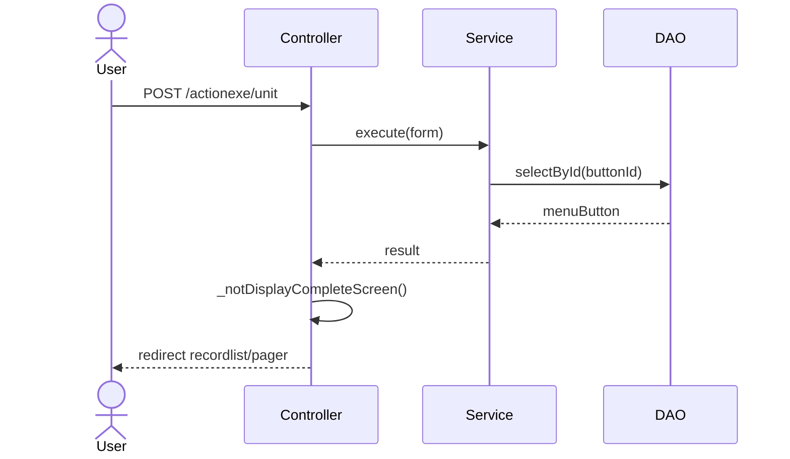
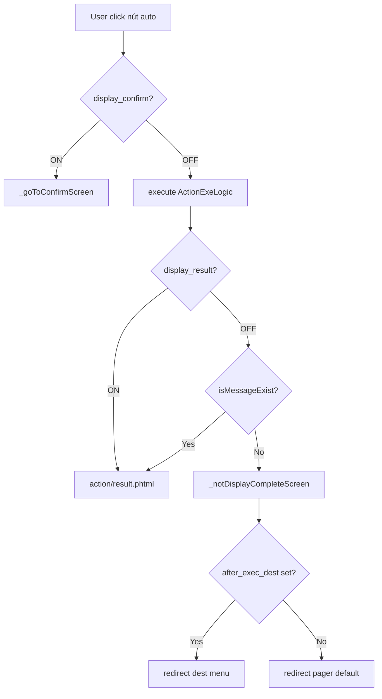

# Survey Codebase

Hướng dẫn cách đọc và phân tích codebase 楽楽販売 (hanbai-product) để tạo `investigate.md`.

## Format từ project rule (bắt buộc)

Format của `investigate.md` **phải** lấy từ "Rule viết tài liệu" (doc-writing) mà orchestrator đã nạp và truyền vào `.dev-team-agent/tasks/<task-id>/project-rules.md`. Đọc phần đó và tuân theo cấu trúc, văn phong, ngôn ngữ quy định.

**Nếu phần doc-writing trống / không có rule**: dừng xử lý, báo orchestrator — **không** dùng format mẫu bên dưới làm fallback.

Format `investigate.md` bên dưới chỉ là **ví dụ tham khảo cấu trúc**.

> Khi chạy độc lập không qua orchestrator: tự nạp doc-writing rule qua skill `read-project-rules` trước; vẫn áp dụng quy tắc bắt buộc ở trên.

## Mục tiêu

Xác định chính xác phạm vi ảnh hưởng (blast radius) của task, trace call chain từ entry point, tránh bỏ sót hoặc over-scope.

## Quy trình survey

### 1. Đọc issue và xác định entry point

- Đọc kỹ issue: description, steps to reproduce, acceptance criteria.
- Xác định màn hình / chức năng liên quan → tìm controller/action tương ứng.
- Dùng Serena MCP `find_symbol` hoặc `find_implementations` để locate code.

### 2. Trace call chain

Từ entry point (controller action), trace xuống:
- Controller → Service → Repository → DB
- Ghi lại từng layer: `ClassName::methodName()` → `file:line`
- Dùng `find_referencing_symbols` để tìm caller của method cần sửa.

### 3. Xác định phạm vi ảnh hưởng

Với mỗi method cần sửa, kiểm tra:
- Những nơi khác gọi method này (side effects)
- Shared utility functions có bị ảnh hưởng không
- DB schema liên quan (table, column, foreign key)
- Session / cache liên quan

### 4. Kiểm tra test coverage

- Tìm file test tương ứng (pattern: `test/` hoặc `tests/` + tên class)
- Ghi nhận coverage hiện tại và test nào có thể bị break

### 5. Confidence scoring

Với mỗi phát hiện, gán confidence:
- **High**: đã đọc code trực tiếp, logic rõ ràng
- **Medium**: suy luận từ naming/pattern, chưa xác nhận toàn bộ
- **Low**: giả định, cần xác nhận thêm

## Format `investigate.md`

### §3. Flow xử lý — chọn format theo độ phức tạp

Không cứng nhắc dùng một dạng. Căn cứ theo số bước và có nhánh điều kiện không:

| Độ phức tạp | Format | Khi nào dùng |
|---|---|---|
| Linear / 1–2 bước | Text flow (nested list) | Flow thẳng, không có nhánh đáng kể |
| 3–5 bước, có nhánh | Mermaid `sequenceDiagram` | Có Actor / Controller / Service tương tác qua lại |
| Nhiều nhánh, state machine | Mermaid `flowchart TD` | Logic điều kiện phức tạp, nhiều luồng khác nhau |

Ví dụ **text flow** (đơn giản):
```
User click nút
  → ActionexeController::unitAction() [ActionexeController.php:20]
  → ActionExeLogic::execute() [ActionExeLogic.php:45]
  → _notDisplayCompleteScreen() [ActionexeController.php:817]
       → _forward('pager', 'recordlist')
```

Ví dụ **sequence diagram** (trung bình):
````markdown

````

Ví dụ **flowchart** (phức tạp, nhiều nhánh):
````markdown

````

---

### §4. Phạm vi ảnh hưởng — format 3 subsection (chuẩn chi tiết)

Luôn tách thành **4.1 DB/schema**, **4.2 Files cần sửa**, **4.3 Blast radius**. Không gộp thành bullet list chung.

```markdown
## 4. Phạm vi ảnh hưởng

### 4.1 DB / schema
| Table | Column | Trạng thái | Evidence |
|---|---|---|---|
| `menu_button` | `after_exec_dest_menu_id` | Patch đã có (F1) | `dbpatch_14_0_0_2.php` L25 |

### 4.2 Files cần sửa
**<Nhóm chức năng (ví dụ: Admin UI)>**

| File | Method | Thay đổi dự kiến | Confidence |
|---|---|---|---|
| `path/to/File.php` | `registMenuButton()` | Persist `AFTER_EXEC_DEST_MENU_ID` | High |

**Có thể bị ảnh hưởng (ngoài scope MVP)**

| File | Lý do |
|---|---|
| `RecordconductController.php` | cancelAction dùng menu_format — có thể cần mở rộng |

### 4.3 Blast radius
- **Caller ngoài scope**: <method X được gọi từ Y — có bị ảnh hưởng không?>
- **Backward compatible**: NULL column → giữ hành vi cũ (fallback)
- **Quyền / session / cache**: <nếu có>
```

---

### Template đầy đủ

```markdown
# Investigate — <task-id>

## 1. Tổng quan
<mô tả ngắn vấn đề và scope; IN/OUT scope nếu cần>

## 2. Entry points
| Màn hình / Chức năng | UI trigger | Controller | Action | File / evidence |
|---|---|---|---|---|

## 3. Flow xử lý
<chọn: text flow / sequenceDiagram / flowchart — xem hướng dẫn ở trên>

## 4. Phạm vi ảnh hưởng

### 4.1 DB / schema
| Table | Column | Trạng thái | Evidence |
|---|---|---|---|

### 4.2 Files cần sửa
| File | Method | Thay đổi dự kiến | Confidence |
|---|---|---|---|

### 4.3 Blast radius
<caller ngoài scope, backward compat, quyền>

## 5. Test coverage hiện tại
<mô tả; test đề xuất P0>

## 6. Rủi ro và điểm cần xác nhận
| Rủi ro | Confidence | Ghi chú |
|---|---|---|

## 7. Câu hỏi chưa rõ
<nếu không blocking: ghi ở đây và tiếp tục; nếu blocking: tạo qa.md và báo orchestrator>
```

## Lưu ý

- Không suy diễn quá scope issue. Nếu không chắc, ghi vào mục "Rủi ro" với confidence thấp.
- Nếu gặp câu hỏi cần human quyết định trước khi tiếp tục → tạo `qa.md` và dừng.
