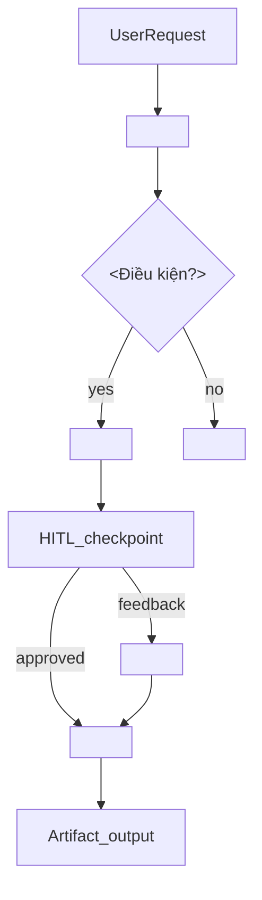

# Pipeline Analysis — <task-id hoặc session-date>

**Ngày phân tích**: <YYYY-MM-DD>
**Phạm vi**: <toàn session | --focus=investigator>
**Thời lượng ước tính**: <N bước / N tool calls>

---

## 1. Timeline session

| # | Phase | Mục tiêu | Bước chính | Tool/Skill | Artifact |
|---|-------|----------|------------|------------|----------|
| 1 | <phase> | <mục tiêu> | <bước> | <tool/skill> | `<file>` |

---

## 2. Sơ đồ suy luận AI

> Điều chỉnh sơ đồ theo session thực tế. Node ID không có space; label đặt trong ngoặc vuông.

---

## 3. Phân tích theo phase

### Phase: <tên phase>

| Bước | Mô tả | Tool/Skill | Số lần gọi | Vấn đề nhận thấy |
|------|-------|------------|------------|------------------|
| 1.1 | <mô tả> | <tool> | N | <vấn đề hoặc -> |

#### Self-question (áp dụng cho phase này)

**Gộp bước nhỏ:**
- <bước X gọi N lần read/grep nhỏ → đề xuất gộp thành ...>

**Skill/Rule cần bổ sung:**
- <tool Y thiếu hướng dẫn → đề xuất thêm vào `skills/<name>/SKILL.md` hoặc `.cursor/rules/...`>

**Tự động hóa (không cần HITL):**
- <bước Z có thể auto vì ... | Rủi ro: Thấp/Trung bình/Cao>

---

## 4. Tổng hợp cơ hội tối ưu

### 4.1 Gộp bước / giảm số lần gọi

| Bước hiện tại | Số lần | Đề xuất | Lợi ích ước tính |
|---------------|--------|---------|------------------|
| <mô tả> | N | <gộp vào skill X / batch search> | Giảm ~N tool calls |

### 4.2 Skill / Rule cần mô tả rõ hơn

| Công cụ / Pattern | Vấn đề | File đề xuất | Nội dung cần thêm |
|-------------------|--------|--------------|-------------------|
| <Serena search_symbol> | Agent gọi lặp không có pattern | `skills/survey-codebase/SKILL.md` | <mô tả ngắn> |

### 4.3 Tự động hóa (không cần human review)

| Bước | Hiện tại | Đề xuất auto | Rủi ro | Ghi chú |
|------|----------|--------------|--------|---------|
| <doc-review sau investigate> | HITL hỏi yes/no | `--auto-review` flag | Thấp | Đã có pattern trong orchestrator |

---

## 5. Đề xuất cải tiến (ưu tiên)

| Ưu tiên | Loại | Đề xuất | Effort | Impact | Phạm vi thay đổi |
|---------|------|---------|--------|--------|------------------|
| P0 | Tối ưu bước | <mô tả> | S/M/L | Cao | skill `<name>` |
| P1 | Skill/Rule mới | <mô tả> | M | Trung bình | plugin `<name>` |
| P2 | Tự động hóa | <mô tả> | S | Thấp | orchestrator flag |
| P2 | Giảm token/latency | <mô tả> | M | Trung bình | <mô tả> |

### Chi tiết đề xuất P0

**<Tiêu đề đề xuất>**

- **Vấn đề**: <mô tả cụ thể từ session>
- **Giải pháp**: <mô tả>
- **Không làm trong scope này**: skill/rule do human tạo sau khi duyệt báo cáo

---

## 6. Ghi chú

- Phân tích dựa trên session thực tế, không lý tưởng hóa pipeline lý thuyết.
- Đề xuất thay đổi skill/rule ≠ tự sửa code — human quyết định implement.
- Nếu session không qua dev-team-orchestrator: ghi rõ pipeline thực tế đã dùng.
